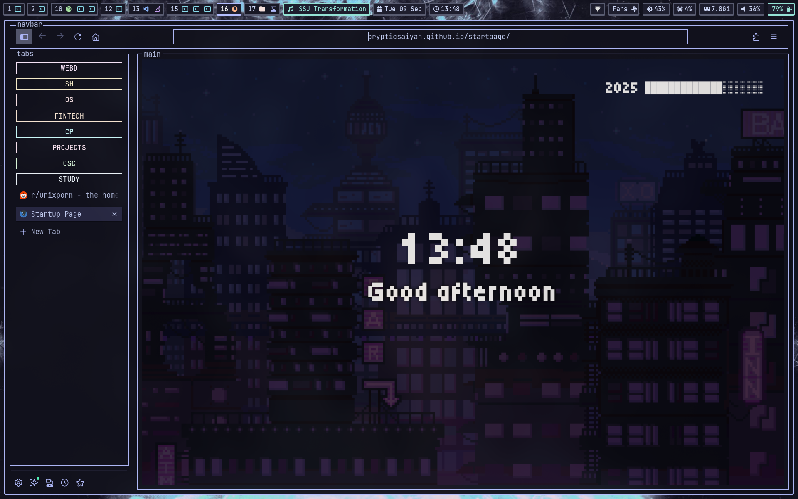
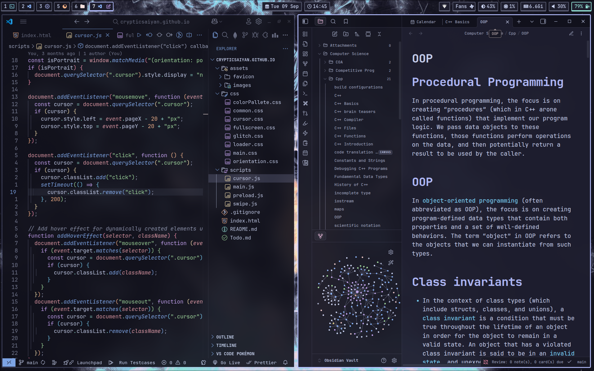
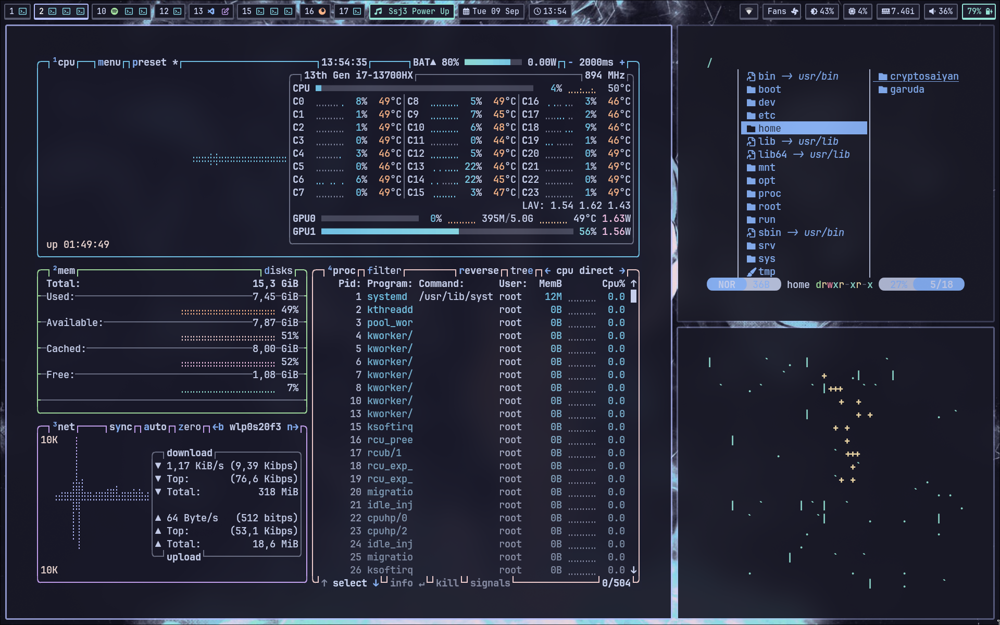

# Dotfiles

This repository contains my personal configuration files and dotfiles for Arch Linux with Hyprland window manager.

| | |
|---|---|
|  |  |
|  |  |
|  |  |
|  |  |
|  | |

## System Details

**OS:** Garuda Linux  
**Desktop Environment / Window Manager:** Hyprland  
**Terminal:** Kitty  
**Shell:** Fish  
**Editor:** Neovim, VS Code  
**Browser:** Firefox  
**Music:** Spotify  
**System Monitor:** btop  
**Lock Screen:** Hyprlock  
**Status Bar:** Waybar  
**Launcher:** Rofi  
**Notifications:** Mako  
**Note-taking:** Obsidian  
**File Manager:** Yazi  
**Effects / CLI Toys:** terminal-rain, Cava, tty-clock  
**Prompt:** Starship  
**Fetch:** Fastfetch